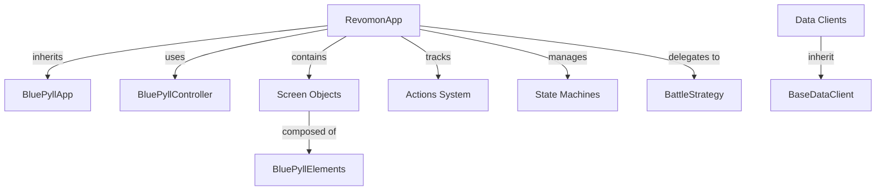

# RevomonAuto: Expert-Level Technical Analysis

## Executive Summary

**RevomonAuto** is a sophisticated Python automation framework (v0.3.2) specifically built for automating the Revomon Android game running in BlueStacks. The project demonstrates advanced software engineering patterns including state machines, decorator-based action tracking, OCR integration, pluggable strategy patterns, and comprehensive game data access through specialized client libraries.

**Technology Stack:**
- **Python 3.13+** - Modern Python with latest type hints
- **BluePyll 0.1.16** - Custom UI automation framework built on ADB
- **Package Manager:** uv (modern, fast Python package/project manager)
- **Testing:** pytest with unittest mocks
- **OS:** Windows (BlueStacks dependency)

---

## Architecture Overview

### Core Design Principles

1. **Dual State Machine Architecture** - Separate GameState and BattleState for robust state management
2. **Decorator-Based Action System** - Automatic action tracking with state differentials
3. **Screen Object Pattern** - Modular UI element definitions per screen
4. **Strategy Pattern** - Pluggable battle AI implementations
5. **Client-Server Pattern** - Specialized data access clients with unified base class

### Component Hierarchy



---

## Project Structure Deep Dive

### Directory Organization

```
RevomonAuto/
├── src/revomonauto/
│   ├── models/                    # Core automation logic
│   │   ├── revomon_app.py         # Main app controller (2113 lines!)
│   │   ├── states.py              # State enums + decorators
│   │   ├── action.py              # Action tracking system
│   │   ├── strategies.py          # Battle AI strategies
│   │   └── revomon_ui/            # UI definitions
│   │       ├── assets/            # Image templates for matching
│   │       ├── elements/          # Element definitions (.py)
│   │       └── screens/           # Screen object models
│   └── data/
│       └── gradex_clients/        # 17+ game data clients
├── examples/
│   ├── main.py                    # Full workflow demo
│   └── example_client_usage.py   # Data client examples
├── tests/                         # Unit tests
└── pyproject.toml                 # Modern Python config
```

---

## State Management System

### Dual State Machine Design

The application uses a **hierarchical state machine** where [GameState](file:///F:/Revomon/RevomonAuto/src/revomonauto/models/states.py#5-30) is the primary state and [BattleState](file:///F:/Revomon/RevomonAuto/src/revomonauto/models/states.py#32-38) is a sub-state active only during battles.

#### GameState Enum (15 states)

```python
class GameState(Enum):
    # Login Flow
    NOT_STARTED  # App not yet launched
    STARTED      # On title screen
    
    # Main Game
    OVERWORLD    # Walking around, free roaming
    MAIN_MENU    # Menu overlay open
    
    # Sub-menus (all accessible from MAIN_MENU)
    MENU_BAG, WARDROBE, FRIENDS_LIST, SETTINGS
    REVODEX, MARKET, DISCUSSION, CLAN
    
    # Special States
    PVP_QUEUE    # Waiting for PVP match
    BATTLE       # In combat (activates BattleState)
    TV           # PC/storage interface
```

#### BattleState Enum (4 states)

Only active when `GameState == BATTLE`:

```python
class BattleState(Enum):
    IDLE                  # Can select attack/bag/run
    BAG_OPEN             # Bag menu visible
    ATTACKS_MENU_OPEN    # Move selection visible
    WAITING_FOR_OPPONENT # Turn processing
```

### State Validation with Decorators

The `@requires_state` decorator enforces state preconditions:

```python
@requires_state(GameState.BATTLE)
@action
def choose_move(self, strategy=None):
    # Only executes if in BATTLE state
    # Logs warning and returns early if wrong state
```

**Key Insight:** This prevents invalid actions (e.g., trying to attack when not in battle) and makes debugging state transitions much easier.

---

## Action Tracking System

### Design Philosophy

Every user action is **automatically logged** with:
- State before/after (diff computed)
- Success/failure status
- Error messages
- Timestamp (via action ID)
- Reference to previous action

### Implementation Details

**Action Class** (dict subclass with constrained keys):

```python
class Action(dict):
    allowed_keys = {
        "action_id", "status", "error_message", 
        "action_name", "state_diff", "last_action"
    }
```

**Actions Class** (list subclass that only accepts [Action](file:///F:/Revomon/RevomonAuto/src/revomonauto/models/action.py#6-51) objects):
- Immutable (no remove/pop/clear)
- Type-enforced append
- Provides audit trail

**@action Decorator:**

```python
def action(func):
    def wrapper(self, *args, **kwargs):
        old_state = capture_state(self)
        try:
            func(self, *args, **kwargs)
            self.wait_for_action(action=func.__name__)
            new_state = capture_state(self)
            # Creates Action with state diff
        except Exception as e:
            # Creates Action with error
        finally:
            self.actions.append(current_action)
            self.last_action = current_action
```

**Tracked State Variables:**
- [current_screen](file:///F:/Revomon/RevomonAuto/src/revomonauto/models/revomon_ui/screens/battle_screen.py#37-97), `game_state`, `battle_sub_state`
- `tv_current_page`, `tv_slot_selected`, `tv_searching_for`
- `current_city`, `current_location`
- `bluestacks_state`, `app_state`

**Use Case:** Debug automation failures by replaying the action history and seeing exactly where state diverged from expected.

---

## Screen Detection System

### Screen Object Pattern

Each screen (battle, login, overworld, etc.) is a `BluePyllScreen` subclass with:
- Named elements (buttons, text regions, pixel checks)
- [is_current_screen()](file:///F:/Revomon/RevomonAuto/src/revomonauto/models/revomon_ui/screens/battle_screen.py#37-97) method for detection

**Example: BattleScreen**

```python
class BattleScreen(BluePyllScreen):
    def __init__(self):
        super().__init__(
            name="battle",
            elements={
                "run_button": ...,
                "attacks_button": ...,
                "player1_mon_nameplate_pixel": ...,
                "player1_mon_move1_button": ...,
                # 20+ elements
            }
        )
    
    def is_current_screen(self, bluepyll_controller, 
                          bluepyll_screenshot=None, phase=None):
        # Checks pixel colors of nameplates
        # Returns True if both player nameplates detected
```

### Detection Methods

**Pixel Color Checking:**
```python
bluepyll_controller.image.check_pixel_color(
    target_coords=(x, y),
    target_color=(r, g, b),
    image=screenshot_bytes
)
```

**Image Template Matching:**
```python
self.is_element_visible(element)
```

**OCR Text Detection:**
```python
bluepyll_controller.image.img_txt_checker.read_text(image_path)
```

### Screen-Specific Methods

[RevomonApp](file:///F:/Revomon/RevomonAuto/src/revomonauto/models/revomon_app.py#35-2113) implements wrapper methods:
- [is_on_battle_screen()](file:///F:/Revomon/RevomonAuto/src/revomonauto/models/revomon_app.py#1405-1438) → updates to `GameState.BATTLE`
- [is_attacks_menu_screen()](file:///F:/Revomon/RevomonAuto/src/revomonauto/models/revomon_app.py#1439-1472) → updates to `BattleState.ATTACKS_MENU_OPEN`
- [is_overworld_screen()](file:///F:/Revomon/RevomonAuto/src/revomonauto/models/revomon_app.py#1257-1289), [is_main_menu_screen()](file:///F:/Revomon/RevomonAuto/src/revomonauto/models/revomon_app.py#1373-1404), etc.

**Critical Implementation Detail:** Screen detection methods **update the state machines** as a side effect, creating tight coupling between detection and state management.

---

## Battle Automation System

### OCR-Based Data Extraction

**Battle Info Extraction ([extract_battle_info](file:///F:/Revomon/RevomonAuto/src/revomonauto/models/revomon_app.py#242-354)):**

Captures and OCRs from screenshot:
1. Player 1 mon name, level, HP bar
2. Player 2 (opponent) mon name, level, HP bar

Stores in `self.mon_on_field` and `self.opps_mon_on_field`:

```python
{
    "name": "Gorcano",
    "level": 50,
    "current_hp_percentage": 87.5,
    "moves": [...],
    # ... other fields
}
```

**HP Calculation via Pixel Analysis:**

```python
def extract_health_percentage(self, image_path, padding=5):
    # Scans middle row of health bar image
    # Counts non-black pixels (health) vs black pixels (missing)
    # Returns percentage: health_pixels / total_pixels * 100
```

**Move Extraction ([extract_battle_moves](file:///F:/Revomon/RevomonAuto/src/revomonauto/models/revomon_app.py#355-471)):**

OCRs 4 move buttons to extract:
- Move name
- PP (current/total)

**OCR Post-Processing:**
```python
def process_move_data(move_data):
    # Fixes common errors: "h" → "/", "o" → "0", "t" → "1"
    # Handles format: ["Tackle", "10/15"]
```

### Battle Strategy System

**Abstract Base Class:**

```python
class BattleStrategy(ABC):
    @abstractmethod
    def select_move(self, valid_move_names: list[str]) -> str:
        pass
```

**Included Implementation:**

```python
class RandomMove(BattleStrategy):
    def select_move(self, valid_move_names):
        return random.choice(valid_move_names)
```

**Custom Strategy Example (from README):**

```python
class SuperEffectiveStrategy(BattleStrategy):
    def select_move(self, valid_move_names):
        moves = [moves_client.get_move_by_name(name) 
                 for name in valid_move_names]
        for move in moves:
            effectiveness = types_client.get_effectiveness(
                move['type'], opponent_type
            )
            if effectiveness > 1.0:
                return move['name']
        return moves[0]['name']  # Fallback
```

### Choose Move Flow

```python
@requires_state(GameState.BATTLE)
@action
def choose_move(self, strategy: BattleStrategy = None):
    if self.auto_run:
        self.run_from_battle()
        return
    
    if self.auto_battle:
        self.open_attacks_menu()
        
        strategy = strategy or RandomMove()
        
        # Filter to valid moves (PP > 0)
        valid_moves = [
            move for move in self.mon_on_field["moves"]
            if move.get("name") and move.get("pp", {}).get("current", 0) > 0
        ]
        
        move_name = strategy.select_move([m["name"] for m in valid_moves])
        
        # Find button index and click
        original_index = next(
            i for i, move in enumerate(self.mon_on_field["moves"])
            if move.get("name") == move_name
        )
        move_btn = self.screens["battle"].elements[
            f"player1_mon_move{original_index + 1}_button"
        ]
        self.bluepyll_controller.click_element(move_btn)
```

**Key Features:**
- Auto-run mode bypasses battle
- Validates move availability (PP check)
- Maps selected move back to original button index
- Extensible via strategy pattern

---

## Game Data Client System

### Architecture

**Base Client Pattern:**

```python
class BaseDataClient(ABC):
    def __init__(self, data_file: Path):
        self.data_file = data_file
        self._data: List[Dict] = []
        self._loaded = False
    
    def load_data(self, force_reload=False):
        # Lazy loading with caching
        with open(self.data_file) as f:
            self._data = json.load(f)
    
    def get_all(self) -> List[Dict]:
        self.load_data()
        return self._data.copy()
    
    def find_by_field(self, field, value):
        return [r.copy() for r in self._data if r.get(field) == value]
    
    @abstractmethod
    def get_primary_key_field(self) -> str:
        pass
```

**Design Benefits:**
- Single source of truth for data access patterns
- Lazy loading + caching for performance
- Consistent API across all clients
- Copy-on-return prevents mutation bugs

### Client Catalog (17+ Clients)

#### Core Data Clients
- **RevomonClient** - Species stats, types, evolution chains
- **MovesClient** - Physical/special/status moves database
- **AbilitiesClient** - Ability mechanics and effects
- **TypesClient** - Type effectiveness matrix
- **ItemsClient** - Equipment, consumables, utilities
- **NaturesClient** - Stat modifiers

#### Advanced Mechanics Clients
- **BattleMechanicsClient** - Damage calculation, STAB, weather, critical hits
- **EvolutionClient** - Evolution trees, optimal paths, stat projections
- **WeatherClient** - Weather synergies, team strategies
- **StatusEffectsClient** - Status condition management, immunities

#### World/Collection Clients
- **LocationsClient** - Spawn locations, encounter rates
- **CapsulesClient** - Capsule mechanics, rewards
- **FruitysClient** - Breeding system
- **RevomonMovesClient** - Move compatibility per species

#### Analysis Clients
- **CounterdexClient** - Counter-strategy, matchup analysis

### Example: BattleMechanicsClient

**Capabilities:**
- [calculate_damage()](file:///F:/Revomon/RevomonAuto/src/revomonauto/data/gradex_clients/battle_mechanics_client.py#49-174) - Full damage formula with STAB, weather, type effectiveness
- [simulate_battle_turn()](file:///F:/Revomon/RevomonAuto/src/revomonauto/data/gradex_clients/battle_mechanics_client.py#270-330) - Accuracy check, critical hit calculation, damage range
- [find_optimal_moves()](file:///F:/Revomon/RevomonAuto/src/revomonauto/data/gradex_clients/battle_mechanics_client.py#381-435) - Best moves against specific defender
- [analyze_type_coverage()](file:///F:/Revomon/RevomonAuto/src/revomonauto/data/gradex_clients/battle_mechanics_client.py#436-489) - Team composition analysis
- [reverse_engineer_damage_formula()](file:///F:/Revomon/RevomonAuto/src/revomonauto/data/gradex_clients/battle_mechanics_client.py#537-570) - Learn formula from battle data

**Damage Formula:**

```python
Damage = (((2 * Level / 5 + 2) * Attack * Power / Defense) / 50 + 2) * Modifier

Modifier = STAB * Type * Critical * Weather * Random * Burn * Other
```

**Type Coverage Analysis:**

```python
coverage = battle_client.analyze_type_coverage(team)
# Returns:
{
    'offensive_coverage': {...},  # Types team can hit super-effectively
    'defensive_coverage': {...},  # Resistances
    'weaknesses': {...},           # Shared weaknesses
    'coverage_score': 0.85         # Overall rating
}
```

---

## Key Implementation Patterns

### 1. Wait-For-Action Pattern

Every `@action` method calls [wait_for_action()](file:///F:/Revomon/RevomonAuto/src/revomonauto/models/revomon_app.py#1516-2068) which polls the screen until expected state is reached:

```python
def wait_for_action(self, action: str):
    for attempt in range(max_retries):
        screenshot = adb.capture_screenshot()
        
        match action:
            case "open_main_menu":
                if self.is_main_menu_screen(screenshot):
                    return
            case "login":
                if self.is_overworld_screen(screenshot):
                    return
            # ... many more cases
        
        sleep(0.5)  # Poll interval
```

**Trade-off:** Robust but slow (uses fixed delays). Future optimization: event-driven state detection.

### 2. Screen Object Composition

Each screen is composed of multiple element types:

```python
# In battle_elements.py
run_button = BluePyllElement(
    label="run_button",
    type=ElementType.BUTTON_IMAGE,
    path="assets/battle_assets/run_button.png"
)

run_button_pixel = BluePyllElement(
    label="run_button_pixel",
    type=ElementType.PIXEL_COLOR,
    center=(x, y),
    pixel_color=(r, g, b)
)

player1_mon_name_text = BluePyllElement(
    label="player1_mon_name_text",
    type=ElementType.TEXT_OCR,
    position=(x, y),
    size=(w, h)
)
```

**Element Types:**
- `BUTTON_IMAGE` - Template matching
- `PIXEL_COLOR` - Fast color check
- `TEXT_OCR` - OCR text extraction

### 3. TV/PC Element Generation

Previously had 30 hardcoded slot definitions. Refactored to use helper function:

```python
def create_tv_slot_element(slot_number: int) -> dict:
    return {
        "label": f"tv_slot_{slot_number}",
        "position": calculate_position(slot_number),
        "size": (w, h)
    }

# Generate all 30 at once
tv_slots = {f"tv_slot_{i}": create_tv_slot_element(i) 
            for i in range(1, 31)}
```

---

## State Update Mechanism

### Update World State Method

Central method for all state transitions:

```python
def update_world_state(
    self,
    new_app_state=None,
    new_game_state=None,
    new_battle_sub_state=None,
    ignore_state_change_validation=False
):
    if new_app_state:
        self.app_state.current_state = new_app_state
    if new_game_state:
        self.game_state = new_game_state
    if new_battle_sub_state:
        self.battle_sub_state = new_battle_sub_state
```

**Validation:** Can enforce state transition rules (currently mostly bypassed with `ignore_state_change_validation`).

**Coupling:** Screen detection methods call this directly, creating implicit state updates.

---

## Testing Strategy

### Unit Test Example (test_choose_move.py)

**Challenges:**
- RevomonApp has heavy dependencies (BluePyll, PIL, screens)
- Need to mock controller, ADB, screen elements

**Solution:**

```python
# Mock modules before import
sys.modules["bluepyll"] = MagicMock()
sys.modules["PIL"] = MagicMock()

# Mock screen constructors
with patch("revomonauto.models.revomon_app.BattleScreen"):
    app = RevomonApp()

# Setup test state
app.game_state = GameState.BATTLE
app.mon_on_field = {
    "moves": [
        {"name": "Tackle", "pp": {"current": 10}},
        {"name": "Growl", "pp": {"current": 5}},
        {"name": None, "pp": {"current": 0}},  # Invalid
        {"name": "Scratch", "pp": {"current": 0}}  # No PP
    ]
}

# Test
app.choose_move()  # Should select Tackle or Growl
```

**Test Coverage:**
- [test_default_random_strategy()](file:///F:/Revomon/RevomonAuto/tests/test_choose_move.py#81-91) - Verifies RandomMove selection
- [test_custom_strategy()](file:///F:/Revomon/RevomonAuto/tests/test_choose_move.py#92-108) - Tests strategy pattern extensibility
- [test_invalid_move_from_strategy()](file:///F:/Revomon/RevomonAuto/tests/test_choose_move.py#109-122) - Error handling

**Current Status:** Limited test coverage, primarily focused on battle logic.

---

## Recent Development History

Based on conversation history, recent work focused on:

1. **Screen Detection Refactoring**
   - Replaced `is_current_scene` → [is_current_screen](file:///F:/Revomon/RevomonAuto/src/revomonauto/models/revomon_ui/screens/battle_screen.py#37-97) (naming consistency)
   - Fixed AttributeError bugs in state detection

2. **Multi-App Controller Support**
   - Enhanced BluePyllController to manage multiple apps
   - New pattern: Apps registered with controller, accessed via dot notation

3. **Battle Strategy Refactoring**
   - Replaced `move_name` + `choose_random` attributes with [strategy](file:///F:/Revomon/RevomonAuto/tests/test_choose_move.py#92-108) parameter
   - Implemented BattleStrategy pattern with RandomMove default
   - Added comprehensive unit tests

4. **Parallel Sensing Implementation**
   - Refactored `_sense_loop` to use `ThreadPoolExecutor`
   - Concurrent element checking for 100+ UI elements
   - State priority system for resolving multiple detections

5. **TV Slot Refactoring**
   - Eliminated 30 repetitive element definitions
   - Implemented helper function + loop pattern

6. **Modal Dialog Management**
   - Implemented single-modal-at-a-time logic
   - Used `ui.timer` to defer closing old modals

---

## Pain Points & Technical Debt

### 1. State Detection Coupling

**Issue:** Screen detection methods update state as side effect.

```python
def is_on_battle_screen(self, ...):
    if self.screens["battle"].is_current_screen(...):
        self.update_world_state(new_game_state=GameState.BATTLE)  # Side effect!
        return True
```

**Impact:** 
- Difficult to query "are we in battle?" without changing state
- Testing requires mocking state updates

**Recommendation:** Separate detection from mutation:
```python
def detect_current_screen(self) -> GameState:
    if self.screens["battle"].is_current_screen(...):
        return GameState.BATTLE
    # ...

def ensure_screen(self, expected: GameState):
    current = self.detect_current_screen()
    if current != expected:
        raise StateError(...)
    self.update_world_state(new_game_state=current)
```

### 2. Fixed Delay Strategy

**Issue:** [wait_for_action()](file:///F:/Revomon/RevomonAuto/src/revomonauto/models/revomon_app.py#1516-2068) uses `sleep(0.5)` in loop, `sleep(1)` everywhere.

**Impact:**
- Slow execution (wastes ~1s per action minimum)
- No adaptation to actual app response time

**Recommendation:** 
- Implement exponential backoff
- Add configurable timeout per action
- Use event-driven detection (if BluePyll supports)

### 3. Large Monolithic File

**Issue:** [revomon_app.py](file:///F:/Revomon/RevomonAuto/src/revomonauto/models/revomon_app.py) is 2113 lines with 61 methods.

**Impact:**
- Difficult to navigate
- Merge conflicts
- Violates Single Responsibility Principle

**Recommendation:** Split into mixins:
```python
class BattleActionsMixin:
    def open_attacks_menu(self): ...
    def choose_move(self): ...

class NavigationActionsMixin:
    def open_main_menu(self): ...
    def close_main_menu(self): ...

class RevomonApp(BluePyllApp, BattleActionsMixin, NavigationActionsMixin, ...):
    pass
```

### 4. TODO Comments

Multiple TODOs indicate incomplete features:
- PVP queue detection (lines 553, 561)
- Battle end detection (README)
- Scene/screen detection tuning
- Clan screen checks (lines 44-53 in main.py)

### 5. Manual Battle End Detection

**Issue:** [main.py](file:///F:/Revomon/RevomonAuto/examples/main.py) requires user to press Enter when battle ends.

```python
input("Press Enter once you are in a battle to continue...")
```

**Recommendation:** Implement battle end detection screen check.

---

## Performance Characteristics

### Bottlenecks

1. **Screenshot Capture** - Every action captures 1-3 screenshots
2. **OCR Processing** - Move/mon name extraction can take 100-500ms
3. **Fixed Delays** - Cumulative 1s+ per action
4. **Sequential Element Checks** - (Though parallel sensing was implemented)

### Optimization Opportunities

1. **Screenshot Reuse** - Pass screenshot between detection methods
2. **OCR Caching** - Cache move names per battle
3. **Adaptive Delays** - Reduce sleep time based on historical action response
4. **Precompiled Regex** - For OCR post-processing

---

## Security & Safety Considerations

### Terms of Service Risk

**Warning in README:**
> Use at your own risk: Automation may violate Revomon's Terms of Service

**Recommendations:**
- Add random delays to appear more human-like
- Rate limiting on actions
- Configurable "breaks" in automation

### Credential Management

[.env](file:///F:/Revomon/RevomonAuto/.env) file stores credentials (not tracked by git):
```env
REVOMON_USERNAME=...
REVOMON_PASSWORD=...
```

**Good:** Not in version control
**Improvement:** Use OS keyring for production use

---

## Dependencies & External Systems

### Core Dependencies

```toml
[project]
dependencies = ["bluepyll==0.1.16"]
requires-python = ">=3.13"
```

**BluePyll Framework:**
- Custom automation framework (not publicly documented in this codebase)
- Wraps ADB for Android automation
- Provides image matching, OCR, pixel checking
- Manages BlueStacks lifecycle

### External Tools

- **BlueStacks** - Android emulator (Windows only)
- **ADB** - Android Debug Bridge (bundled with BlueStacks)
- **EasyOCR/Tesseract** - OCR engine (assumed from BluePyll)

---

## Deployment & Usage

### Installation

```bash
# Modern approach (uv)
uv add revomonauto

# Development
uv sync
uv run examples/main.py
```

### Configuration

[.env](file:///F:/Revomon/RevomonAuto/.env) file:
```env
BLUESTACKS_PATH=C:\Program Files\BlueStacks_nxt\HD-Player.exe
ADB_PATH=C:\Program Files\BlueStacks_nxt\HD-Adb.exe
```

### Typical Workflow

```python
from bluepyll import BluePyllController
from revomonauto.models.revomon_app import RevomonApp

# Initialize
revomon_app = RevomonApp()
controller = BluePyllController(apps=[revomon_app])

# Lifecycle
controller.bluestacks.open()
controller.revomon.open_revomon_app()
controller.revomon.start_game()
controller.revomon.login()

# Navigation
controller.revomon.open_main_menu()
controller.revomon.enter_pvp_queue()

# Battle automation
while True:
    if controller.revomon.is_on_battle_screen():
        controller.revomon.choose_move()
```

---

## Extensibility Points

### Adding New Battle Strategies

```python
class MyStrategy(BattleStrategy):
    def __init__(self, types_client, moves_client):
        self.types = types_client
        self.moves = moves_client
    
    def select_move(self, valid_move_names):
        # Implement custom logic
        return best_move
```

### Adding New Screens

1. Create screen elements file in `revomon_ui/elements/`
2. Create screen class in `revomon_ui/screens/`
3. Add to `RevomonApp.__init__` screens dict
4. Implement [is_current_screen()](file:///F:/Revomon/RevomonAuto/src/revomonauto/models/revomon_ui/screens/battle_screen.py#37-97) method

### Adding New Data Clients

```python
class MyClient(BaseDataClient):
    def __init__(self):
        super().__init__(
            data_file=Path(__file__).parent / "my_data" / "data.json"
        )
    
    def get_primary_key_field(self):
        return "id"
```

---

## Code Quality Metrics

### Strengths

✅ **Modern Python** - Type hints, match-case, Enum
✅ **Design Patterns** - Strategy, Template Method, Decorator, State Machine
✅ **Comprehensive Documentation** - Docstrings, README examples
✅ **Separation of Concerns** - Models vs Data vs Examples
✅ **Extensibility** - Pluggable strategies, screen objects

### Weaknesses

⚠️ **Large Classes** - RevomonApp is 2113 lines
⚠️ **Limited Tests** - Only battle logic tested
⚠️ **Fixed Delays** - No adaptive timing
⚠️ **Manual State Detection** - Some screens not auto-detected
⚠️ **Side Effects** - Detection methods mutate state

---

## Future Roadmap (from README)

- [ ] Background screen detection thread
- [ ] Robust PVP queue state detection
- [ ] Battle end detection
- [ ] Error recovery and retry logic
- [ ] Comprehensive test suite
- [ ] CI/CD pipeline
- [ ] Performance optimization (reduce sleep delays)
- [ ] Docker support

---

## Conclusion

**RevomonAuto** is a well-architected automation framework that demonstrates advanced Python patterns including state machines, decorators, strategy pattern, and client-server architecture. The dual state machine design (GameState + BattleState) provides robust state management, while the action tracking system offers excellent debugging capabilities.

The project's strengths lie in its **extensibility** (pluggable battle strategies, screen objects, data clients) and **comprehensive game data access** (17+ specialized clients). However, there are opportunities for improvement in **performance** (eliminate fixed delays), **code organization** (split monolithic RevomonApp), and **test coverage** (expand beyond battle logic).

The OCR-based battle automation is particularly impressive, extracting mon names, levels, HP, and moves in real-time for use by custom battle AI. The game data client system provides a clean abstraction for accessing complex game mechanics including damage calculations, type effectiveness, evolution chains, and team composition analysis.

**Overall Assessment:** Production-ready for personal use with known limitations. Well-positioned for community contributions due to clean architecture and comprehensive documentation.

---

## Key Metrics

- **Lines of Code:** ~10,000+ (estimated)
- **Main Controller:** 2,113 lines
- **Screen Objects:** 11 screens
- **UI Elements:** 100+ defined elements
- **Data Clients:** 17 specialized clients
- **State Enums:** 19 total states (15 GameState + 4 BattleState)
- **Action Methods:** 61 in RevomonApp
- **Python Version:** 3.13+
- **Test Files:** 4 (test_choose_move.py, test_clients.py, test_locations_client.py, test_states.py)

---

**Document Generated:** 2025-11-22  
**Project Version:** 0.3.2  
**Analysis Depth:** Expert-level, low-level implementation details
